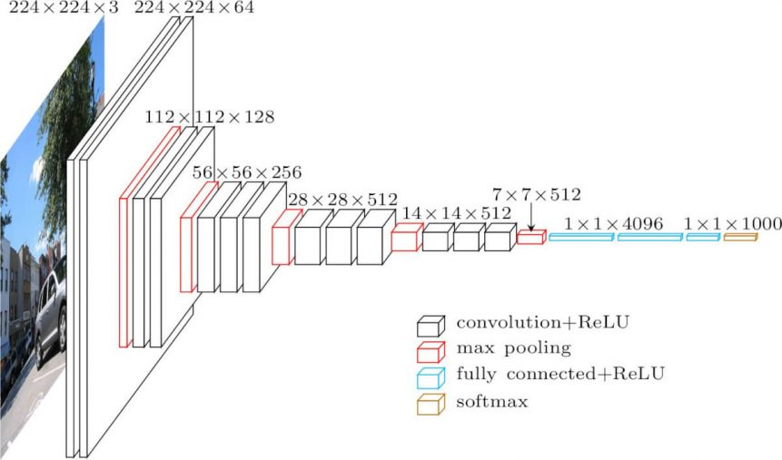

# Mars Terrain Anomaly Detection
#### Training a Neural Network to identify interesting features on Martian topography, based off a images gathered by the Mars Reconnaissance Orbiter. 


## Author
- Saad Saeed: 
[LinkedIn](https://www.linkedin.com/in/saadsaeed85/) |
[GitHub](https://github.com/ssaeed85) |
[Email](mailto:saadsaeed85@gmail.com)


# Business Understanding

Space exploration and understanding has been growing over the last few decades with the spark being lit during the space race during the latter half of the 20th century. After the end of the Apollo space program, man's venture into space has been relegated to low earth orbit missions.  

Unmanned missions have since had many a success story such as the Voyager 2 going interstellar in 2018, over 40 years after its launch. The future of space exploration is going to be handled by such manned missions for the foreseeable future. However, being physically on site isn't the only way to explore space.  

For centuries, man has looked up at the night sky to find out more about our celestial neighbors. With improvements in technologies our ability to gather data through telescopes and cameras has improved significantly and the value provided by telescopes in space has been immeasurable. The James Webb (infrared) telescope was launched in December 2021 and hopes to view objects too old, distant, and faint for the Hubble Space Telescope.

Pointing the telescope and gathering data is only the first step. Being able to parse terabytes, petabytes or even yottabytes of data manually is a nigh impossible task, a task computer vision is especially suited for. Being able to identify interesting features can help us whittle down potential candidates to explore 'in-person' and in the long run help mitigate losses.

Interest in space exploration has seen a resurgence with private enterprise taking an interest. Although this project specifically looks at the Mars topography, similar techniques can be applied to any celestial body, or even to our home planet.


# Overview
We shall be using images captured from the HiRISE camera system on board the Mars Reconnaisance Orbiter which was built under direction from University of Arizona's Lunar and Planetary Laboratory. Following is an excerpt from the [University of Arizona website](https://www.lpl.arizona.edu/missions/hirise-mro).

>The **Hi**gh **R**esolution **I**maging **S**cience **E**xperiment (HiRISE) onboard the Mars Reconnaissance Orbiter, is the most powerful camera ever sent to another planet. The resolution of the camera allows us to see the Red Planet in amazing detail, and lets other missions, like the Mars Science Laboratory, find a safe place to land and carry out amazing science. The operations center, which includes not only observation planning, but the execution of commands sent to the spacecraft along with actual image processing, is located within LPL at the University of Arizona.

We shall be building off of the work performed by the original team. The dataset comes pre-augmented and segmented into training, validation and test sets. The test side will be set aside to ascertain effectiveness of our final model. The training set will be used to train the model and the validation scores on the validation set will be used as a metric to pick our model, specifically our validation loss.

# The Data:
The work performed herein was built off of the shoulders of giants, the original project that created the dataset and labeled the images. Here follows an excerpt from their site describing the data.

> [](https://doi.org/10.5281/zenodo.4002935)
>
>__Project member(s)__:\
>Topher Allen; Zach Anderson; Berlin Chen; Ameya Daigavane; Annie Didier; Marko Green; Paul Horton; Hannah Kerner; Lauren Klein; Benjamin Kolber; Ellie Kuang; Kyle Kung; Jake Lee; Justin Martia; Brian Milch; James Montgomery; Kyle Pearson; Sanjna Ravichandar; Arun Viswanathan; Caleb Wagner; Amruta Yelamanchili; Brandon Zhao
>
>__Abstract__:\
>This dataset contains a total of 64,947 landmark images that were detected and extracted from HiRISE browse images, spanning 232 separate source images.
>
>This set was formed from 10,815 original landmarks. Each original landmark was cropped to a square bounding box that included the full extent of the landmark plus a 30-pixel margin to the left, right, top, and bottom. Each landmark was then resized to 227x227 pixels. 9,022 of these images were then augmented to generate 6 additional landmarks using the following methods:
>
>90 degrees clockwise rotation
>180 degrees clockwise rotation
>270 degrees clockwise rotation
>Horizontal flip
>Vertical flip
>Random brightness adjustment
>The remaining 1,793 images were not augmented. Combining these with the 7*9,022 images, gives a total of 64,947 separate images.
>
> __Contents__:
>- map-proj-v3_2/: Directory containing individual cropped landmark images
>- labels-map-proj-v3_2.txt: Class labels (ids) for each landmark image. File includes two columns separated by a space: filename, class_id
>- labels-map-proj-v3_2_train_val_test.txt: Includes train/test/val labels and upsampling used for trained model. File includes three columns separated by a space: filename, class_id, set
>- landmarks_map-proj-v3_2_classmap.csv: Dictionary that maps class ids to semantic names
>
> __Class Discussion__:\
>We give a discussion of the various landmarks that make up our classes.
>
>Bright dune and dark dune are two sand dune classes found on Mars. Dark dunes are completely defrosted, whereas bright dunes are not. Bright dunes are generally bright due to overlying frost and can exhibit black spots where parts of the dune are defrosting.
>
>The crater class consists of crater images in which the diameter of the crater is greater than or equal to 1/5 the width of the image and the circular rim is visible for at least half the crater's circumference.
>
>The slope streak class consists of images of dark flow-like features on slopes. These features are believed to be formed by a dry process in which overlying (bright) dust slides down a slope and reveals a darker sub-surface.
>
>Impact ejecta refers to material that is blasted out from the impact of a meteorite or the eruption of a volcano. We also include cases in which the impact cleared away overlying dust, exposing the underlying surface. In some cases, the associated crater may be too small to see. Impact ejecta can also include lava that spilled out from the impact (blobby ("lobate") instead of blast-like), more like an eruption (triggered by the impact). Impact ejecta can be isolated, or they can form in clusters when the impactor breaks up into multiple fragments.
>
>Spiders and Swiss cheese are phenomena that occur in the south polar region of Mars. Spiders have a central pit with radial troughs, and they are believed to form as a result of sublimation of carbon dioxide ice. This process can produce mineral deposits on top, which look like dark or light dust that highlights cracks in the CO2 ice. Spiders can resemble impact ejecta due to their radial troughs, but impact ejecta tends to have straight radial jets that fade as they get farther from the center. The spider class also includes fan-like features that form when a geyser erupts through the CO2 layer and the material is blown by the wind away from the cracks. Fans are typically unidirectional (following the wind direction), whereas impact ejecta often extends in multiple directions. Swiss cheese is a terrain type that consists of pits that are formed when the sun heats the ice making it sublimate (change solid to gas).
>
>Other is a catch-all class that contains images that fit none of the defined classes of interest. This class makes up the majority of our data set.

That last line in the description is going to be key, as can be seen by the figure below.


Although the dataset is fairly large and the team has done a fantastic job with augmenting the dataset, there is a huge class imbalance. Even a baseline dummy classifier will achieve nearly 80% accuracy during training, in fact:


The numbers are higher in the test set, sitting at nearly 82%. Any chosen model would have to perform significantly better than this. Also, as a direct result of this, I decided to use validation loss as a metric to be used in conjunction with accuracy.


# Modeling

## Metric
---
Validation loss will be the primary metric to determine model performance in conjunction with validation accuracy. More specifically, the loss function will be categorical cross entropy, a loss function specific to multiclass classification. Since our dataset is heavily imbalanced, and having a high accuracy is not going to be enough,validation loss gives us insight quality of the accurate predictions. As a brief intro:

<p style="text-align:center;">
</p>

<h4 style="text-align:center;">
<a href="https://towardsdatascience.com/cross-entropy-loss-function-f38c4ec8643e">Image credit: Kilprono Elijah Koech</a>
</h4>


___S___ is a list of probabilities for the 4 classes associated with the above example and ___T___ are the ground truth values for the same. The cross entropy validation loss formula is:

$$
\begin{align}
L_{cross-entropy} ~&=~ -\Sigma_{i=1}~T_i~ln(S_i)\\
&=~ -[ 1 \cdot ln(0.775) ~+~ 0 \cdot ln(0.116) ~+~ 0 \cdot ln(0.039) ~+~ 0 \cdot ln(0.070)]\\
&=~ -[ 1 \cdot ln(0.775)]\\
&=~ 0.2549
\end{align}
$$


With the goal of minimizing validation loss, looking at the math, it penalizes the further away the logit value is from the true value. A model that classifies by calling the most frequent class, would result in a validation loss of *inf* because in cases where the model is wrong, the loss function returns a ***ln(0)***

As a result although we shall be looking at the accuracy of our model as an indicator of performance, we shall be using cross entropy validation loss as metric to pick our best performing model.


## Callbacks
---
Tensorflow's neural networks employs callbacks which allow for additional features. A few different callbacks were used in my notebooks.
 
### EarlyStop
EarlyStop allows us to quit the modeling process early especially if the model has started to diverge. Since the metric to watch is validation loss, I employed EarlyStop to kill the modeling process if validation loss does not decrease for certain number of epochs. Although this ensures that I wouldn't really be able to get the most out of my model, giving a wide enough window was key in making the judgement whether my time/resources were better spent on training a different model/technique. Most of my early models used this callback.
As an added bonus, the model's best epoch weights will be retained instead of the final epoch scores

### LearningRateScheduler
The disadvantage of having a high learning rate is the model may not converge and bounce around the optimal solution, while the disadvantage of a small learning rate is the model has to train longer to get to a solution. LearningRateScheduler is a callback that allows us to change the learning rate of the algorithm _during_ the training process. Using such a tool can allow us to get the best of both worlds. 
It can be exact learning rates for sets of epochs if desired, however, in most cases I opted to go with an exponentially decreasing learning rate. 

### CSVLogger
I used a CSVLogger callback for some of my final models to make a dedicated log file that captures all metrics at the end of the epoch. This is primarily for posterity and visualizations.

### ModelCheckpoint
ModelCheckpoint as the name suggests allows us to create a checkpoint and save the model. By default, a model will retain the weights of the last epoch, however depending upon your parameters and how long the model was run it may not be the best parameters. I used it to capture model weights for the epoch where validation loss was at its minimum.

## Pooling
---
Whenever given a choice, I used MaxPooling over AveragePooling as a pooling technique. In images it helps with increasing contrast while reducing dimensions. Although average pooling is a sufficient technique, MaxPooling has shown to be really effective for images.

Lets have a quick look at the two different techniques on a couple of sample images from the dataset, using a final 5x5 pooling kernel.


As you can see, both techniques reduce the dimensions of the image by the same amount, however with slightly different results with the differences being more evident than in others. However, my main takeway should be that MaxPooling tends to increase contrast which would allow the model to learn defining features better. Average Pooling retains the look of the original image better albeit at a lower resolution.

## Methodology:
---
I took a three-pronged approach to try and achieve a good model:
- training models from scratch. This is the most verbose part of the project with variations in architecture to increase or decrease complexity/regularizations.
- training models on pre-established Convolutional Neural Net model architectures with a random weight initialization. Essentially training a [LeNet-5]() and a [AlexNet](https://proceedings.neurips.cc/paper/2012/file/c399862d3b9d6b76c8436e924a68c45b-Paper.pdf) from scratch.
- training on a pre-trained model with existing weights. The model chosen for this was the [VGG16](https://arxiv.org/abs/1409.1556) model.

The results of each of these have a dedicated results section below

# Results:

## Section I:

Training CNN models from scratch 

Of the models that were trained (in notebook [01_TensorflowModeling_Adam](01_TensorflowModeling_Adam.ipynb)), models 8, 10, and 11 seemed to be the most promising. These models were then further refined in [02_TensorflowModeling_FinalModels](02_TensorflowModeling_FinalModels.ipynb) to try and achieve the best validation score


The best performing model was model 10 with a **validation_loss** of 0.4777 and a **validation_accuracy** of 86.55%

## Section II:
Training models on pre-established CNN model architectures with a random weight initialization. Details can be found in the notebooks, [03_TensorflowModeling_AlexNet](03_TensorflowModeling_AlexNet.ipynb) and [04_TensorflowModeling_LeNet](04_TensorflowModeling_LeNet.ipynb).

### AlexNet:


### LeNet-5:


For both these model architectures, the overall modeling process was very erratic, and progress was slow. My intuition would suggest to train with a smaller learning rate for a much higher number of iterations.
In the interest of time, I decided to prioritize other modeling techniques to try and get a better model.

Between the two models AlexNet performed marginally better with a **validation_loss** of 0.6076 and a **validation_accuracy** of 82.21%, where as LeNet performed with a **validation_loss** of 0.7575 and a **validation_accuracy** 79.49%

## Section III:


In 2014, Karen Simonyan, Andrew Zissermanren wrote a paper on _Very Deep Convolutional Networks for Large-Scale Image Recognition_ using 16/19 layer variations of the same architecture called [VGG](https://arxiv.org/abs/1409.1556). This architecture has seen tremendous success in a variety of different arenas.  

As part of the above paper the two variations tested are colloquially called `VGG16` and `VGG19`.  

VGG16 achieves 92.7% top-5 test accuracy in *ImageNet*, a dataset comprising of over 14 million images belonging to 1000 distinct classes. The weights resulting from training the architecture for weeks is the same weights we will be using to initialize our model.  

The original model was designed to work off of an *RGB* image sized *224x224*. To account for this our dataset is loaded as an RGB image even though it is natively a grayscale image. An additional `Flatten()` and `softmax` layer corresponding to our number of classes is added after the `vgg` layer.


This was by far my best performing model **validation_loss** of 0.3356 and a **validation_accuracy** 90.73%. The modeling process was quite choppy. I'd like to retrain this model with potentially a smaller learning rate and/or a larger training batch size/steps per epoch. The latter I tried to optimize, however current hardware became a limiting factor.

Testing our chosen VGG16 model against the test dataset gives us a performance of **loss** of 0.3541 and a **accuracy** 92.30%

# Mars Anomaly Detection

Using the model we can now parse an image of large area of mars to annotate different identifiable features. Here is one such example where the model was used to highlight all craters with a 99%  confidence threshold.

 

Clearly, the model missed a few obvious craters but there is a lot of overlap in areas with high density of craters.


# Conclusions:

Although the metrics of the final model is quantitatively satisfactory, its performance on true unseen data was underwhelming. The imbalance in the dataset aside, the class of `others` was essentially a catch all for images that couldn't be classified into the other categories and/or human labelers had a hard time classifying in general. 

Even to the human eye these might look like they belong to the same set of features but they do not. The images belong to the classes `crater`, `impact ejecta` and `other` respectively.

 
 
 

One potential way of solving this issue would be to get even more data, but more importantly true labeled data. This is especially true for the underepresented features like `spider`s and `impact ejecta`s. Completely reassessing how to classify these images might also help.


# Next Steps:

- Retrain AlexNet and LeNet with a smaller learning rate for a high number of iterations
- Use pretrained weights for AlexNet and LeNet
- Train the VGG16 model for more epochs for a smaller learning rate, however I believe at this point there will be some diminishing returns.
- Undersample or drop the majority class `other` and see if resulting models are better at delineating features. Initial forays into this were not too promising.
- Gather more labeled data to help minority representation.
- Implement *Intersection Over Union* to clean up annotation of images


# Citations: 

[Gradient-Based Learning Applied to Document Recognition](http://yann.lecun.com/exdb/publis/pdf/lecun-98.pdf) - LeNet-5 - Yann LeCun, Léon Bottou, Yoshua Bengio, Patrick Haffner  
[ImageNet Classification with Deep Convolutional Neural Networks](\https://proceedings.neurips.cc/paper/2012/file/c399862d3b9d6b76c8436e924a68c45b-Paper.pdf) - AlexNet - Alex Krizhevsky,
Ilya Sutskever,
Geoffrey E. Hinton  
[Very Deep Convolutional Networks for Large-Scale Image Recognition](https://arxiv.org/abs/1409.1556) - VGG - Karen Simonyan, Andrew Zisserman  

[HiRISE](https://www.uahirise.org/) - The Lunar & Planetray Laboratory at University of Arizona - Database of HiRISE images

[Cross-Entropy Loss Function](https://towardsdatascience.com/cross-entropy-loss-function-f38c4ec8643e) - A more detailed explanation


[](https://doi.org/10.5281/zenodo.4002935) - Dataset


# Repository Structure
```
├── extractedData *
├── extraNotebooks  
├── images *
│     ├── train *
│     |     ├── bright dune *
│     |     ├── crater *
│     |     ├── dark dune *
│     |     ├── impact ejecta *
│     |     ├── other *
│     |     ├── slope streak *
│     |     ├── spider *
│     |     └── swiss cheese *
│     ├── val *
│     |     ├── bright dune *
│     |     ├── crater *
│     |     ├── dark dune *
│     |     ├── impact ejecta *
│     |     ├── other *
│     |     ├── slope streak *
│     |     ├── spider *
│     |     └── swiss cheese *
│     └── test *
│           ├── bright dune *
│           ├── crater *
│           ├── dark dune *
│           ├── impact ejecta *
│           ├── other *
│           ├── slope streak *
│           ├── spider *
│           └── swiss cheese *
├── logs  
├── mass_maps  
├── savedFigs  
├── src  
│     ├── imageHandler.py
│     └── helperFunctions.py
|
├── 00_GetDatasets.ipynb  
├── 01_TensorflowModeling_CNN.ipynb  
├── 02_TensorflowModeling_FinalModels.ipynb  
├── 03_TensorflowModeling_AlexNet.ipynb  
├── 04_TensorflowModeling_LeNet.ipynb  
├── 05_TensorflowModeling_VGG16_TransferLearning.ipynb
├── 06_AnomalyDetection.ipynb
|
├── README.md
├── presentation.pdf
├── mars_anomaly_detection_app.py
├── environment.yml
└── TweetSentimentAnalysis_nb.ipynb

* = notebooks will be created as part of running the notebooks.
```
